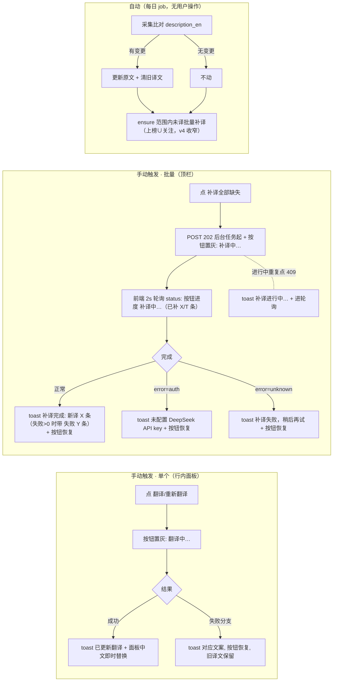

# §7 翻译增强（T-016 追加，v1.5，2026-08-11 本人复验打回后修订）

> 变更注记（v1.5，2026-08-11）：本人 T-016 复验打回拍板——按钮页脚→顶栏＋批量进度可见（设计缺陷修复，实现对齐共识§7"后台执行"）。
> 需求来源：共识 §7 v3（2026-08-10 本人拍板）——全池覆盖＋原文变更自动重译＋手动单/批量触发；v4（2026-08-11 本人拍板）——自动补译/批量补译范围收窄**上榜∪关注**（手动单个不受限），推荐语见 §8。
> 组件分档：行内小按钮与 toast 均为既有冻结视觉体系组件复用，免示意图（2026-08-09 分档口径）；文字层本草稿确认后开发。

### 7.1 元素与位置
- **行内翻译按钮**：行内详情面板标签区右侧（"＋ 标签"按钮旁）。文案按态：无译文显 **"翻译"**，已有译文显 **"重新翻译"**。
- **批量按钮**：顶栏右端（全页面共用顶栏），文字钮 **"补译全部缺失"**。
- 自动路径无界面元素。

### 7.2 主路径逐步序列
**单个重译（场景：看到英文/译文陈旧/译得差，立即自救）**
1. 展开任意项目行 → 点"翻译/重新翻译" → 按钮置灰变"翻译中…"（防连点）。
2. 服务端 `POST /api/translate`（强制重译，覆盖现值）→ 成功：toast"已更新翻译"，面板中文描述即时局部替换（不刷新页面）；按钮恢复按态文案。

**批量补译（场景：发现多处英文，一次补齐；后台任务执行——POST 202 立即返回，前端 2s 轮询进度）**
1. 顶栏点"补译全部缺失" → 按钮置灰变"补译中…"（后台任务已起，POST 202 立即返回，不在请求内跑完）。
2. 前端每 2s 轮询 `/api/translate-missing/status` → 按钮进度文案"补译中…（已补 X/T 条）"（T=0 时保持"补译中…"）；页面加载时若任务在跑，自动接管进度显示。
3. 完成：toast"补译完成：新译 X 条"（有失败条时"补译完成：新译 X 条，失败 Y 条"），按钮恢复"补译全部缺失"。

### 7.3 分支与异常
| 场景 | 走向 |
|---|---|
| 单个：无英文简介 | toast"无简介可译"，按钮恢复 |
| 单个：原文含中文 | toast"原文已是中文，无需翻译"，按钮恢复 |
| 单个：AI/网络失败 | toast"翻译失败，稍后再试"；**旧译文保留不变**，按钮恢复 |
| 批量：进行中（按钮态） | 按钮文案"补译中…（已补 X/T 条）"（T=0 时保持"补译中…"），置灰防连点 |
| 批量：进行中重复点击 | toast"补译进行中…"（服务端 running 态 409），进轮询接管进度 |
| 批量：任务完成 | toast"补译完成：新译 X 条"；失败 Y 条＞0 时"补译完成：新译 X 条，失败 Y 条"；按钮恢复"补译全部缺失" |
| 批量：DeepSeek key 未配置 | toast"未配置 DeepSeek API key"（后台任务 error="auth" 终止整批，已译保留） |
| 批量：后台任务异常/网络失败 | toast"补译失败，稍后再试"（后台任务 error="unknown"；前端网络层失败同文案） |
| 自动：采集比对无变更 | 不动原文不动译文 |
| 自动：单条翻译失败 | 记日志跳过，次日再试（与 T-011 降级链同口径） |

### 7.4 服务端口径（钉死）
- 单个重译＝**强制**（不管现值，覆盖写库）；批量补译＝**只补 NULL**；两者都不触碰推荐理由表。
- 采集变更检测覆盖 description_en 与 language/topics 漂移（T-025 起）；language/topics 漂移仅 UPDATE repos 归类字段，不清译文不删推荐语（归类读时实时算自然生效；漂移率低重生成本高）。
- 全部翻译写操作幂等可重入；失败永不阻塞榜单渲染与每日快照主流程。
