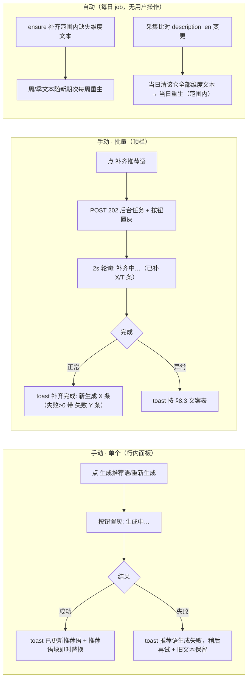

# §8 推荐语增强（T-017 追加，v1.6，2026-08-11 本人确认）

> 需求来源：共识 §7 v4＋架构决策 6 v2（2026-08-11 本人拍板确认）——推荐语**三口径分维度**＋覆盖**上榜∪关注**＋手动单/批量触发＋输入含 README 正文（截断）；关注页/关注集总星维度；总星文本按 README 变更当日重生。
> 组件分档：行内小按钮/顶栏文字钮/toast/后台进度均为既有冻结视觉体系组件复用（与翻译同构、并列不共用），免示意图；本草稿本人确认后开发。

### 8.1 维度与展示规则
- 推荐语按**榜单维度**各生一条：周文本/季文本（增量语境，输入含当期增量）；总星文本（存量语境"是什么＋领域地位"，**不引用具体星数/排名数字**——数字由行内数据展示，防 evergreen 陈旧）。
- 分化钉死（v1.7，2026-08-12 本人复验反馈"周和总星推荐语没差别"）：周/季 prompt 有增量时**必须明确写出当期增星数字**（"本周/本季新增 X 星"），与总星"不引用数字"形成肉眼可辨的稳定差异。
- **推荐语块标题带维度标识**（v1.7）：`周榜推荐语 · {期次}`／`季榜推荐语 · {期次}`／`总星榜推荐语`——一眼可辨该文本属三维度中的哪套；首期空态降级页面上同时解释"当前展示的是总星榜文本"。
- 展示映射：周报页行→周文本（当期周标签）；季度回顾页行→季文本（当期季标签）；总星榜行→总星文本（最新一条）；我的关注页行→总星文本（最新一条——关注页是长期盯梢语境非热点语境，周文本对低增量仓牵强且每周重刷纯 churn，2026-08-11 复验讨论修订）。无对应文本 → 该行无推荐语块（降级，榜单照常出）。

### 8.2 元素与位置
- **行内推荐语按钮**：行内详情面板翻译按钮旁（并列）。文案按态：无当前页维度推荐语显 **"生成推荐语"**，已有显 **"重新生成"**；只在有推荐语展示位的页面（周/季/总星/关注四页）出现，按当前页维度操作。
- **批量推荐语按钮**：顶栏右端"补译全部缺失"旁，文字钮 **"补齐推荐语"**。
- 自动路径无界面元素。

### 8.3 分支与异常（与翻译同构，文案逐字）
| 场景 | 走向 |
|---|---|
| 单个：进行中 | 按钮置灰"生成中…"（防连点） |
| 单个：成功 | toast"已更新推荐语"，推荐语块即时局部替换（不刷新页面）；按钮恢复按态文案 |
| 单个：AI/网络失败 | toast"推荐语生成失败，稍后再试"（err）；**旧文本保留**，按钮恢复 |
| 批量：进行中（按钮态） | "补齐中…（已补 X/T 条）"（T=0 保持"补齐中…"），置灰；页面加载时任务在跑自动接管进度 |
| 批量：进行中重复点击 | toast"补齐进行中…"（409），进轮询接管 |
| 批量：任务完成 | toast"补齐完成：新生成 X 条"；失败 Y 条＞0 时"补齐完成：新生成 X 条，失败 Y 条"；按钮恢复"补齐推荐语" |
| 批量/单个：DeepSeek key 未配置 | toast"未配置 DeepSeek API key"（err） |
| 批量：任务异常/网络失败 | toast"补齐失败，稍后再试"（err） |
| 自动：单条生成失败 | 记日志跳过，次日补缺（与翻译降级链同口径） |

### 8.4 服务端口径（钉死）
- 单个＝**强制重生**（按当前页维度，新文本覆盖同维度当期）；批量＝**只补缺失**（范围内 × 适用维度）。翻译表与其他表不动。
- 覆盖：三口径榜 Top30 去重 ∪ 关注集；关注未上榜仓只生总星维度（供关注页展示）。
- 自动：每日 ensure 补缺（缺各维度文本）；周/季文本随新期次每周重生（季文本季内每周 REPLACE 当季行）；**README 变更（blob sha 指纹每日比对）→ 当日重生总星文本**（周/季不随此触发；行存 readme_sha，NULL 仓后续出现 README 视为变更自愈）；简介变更 → 当日清该仓全部维度文本＋当日重生（范围内）。
- 输入：**README 正文**（GitHub API 拉取、截断入 prompt；空 README/拉取失败 → 退化元数据输入；不持久化——2026-08-11 本人提出，覆盖仅上榜∪关注量级小）＋仓库名/简介/语言/topics/当期增量/总星数等元数据；总星维度 prompt 不引用具体数字。
- 失败永不阻塞榜单渲染与每日快照主流程（降级：该行无推荐语块）。
