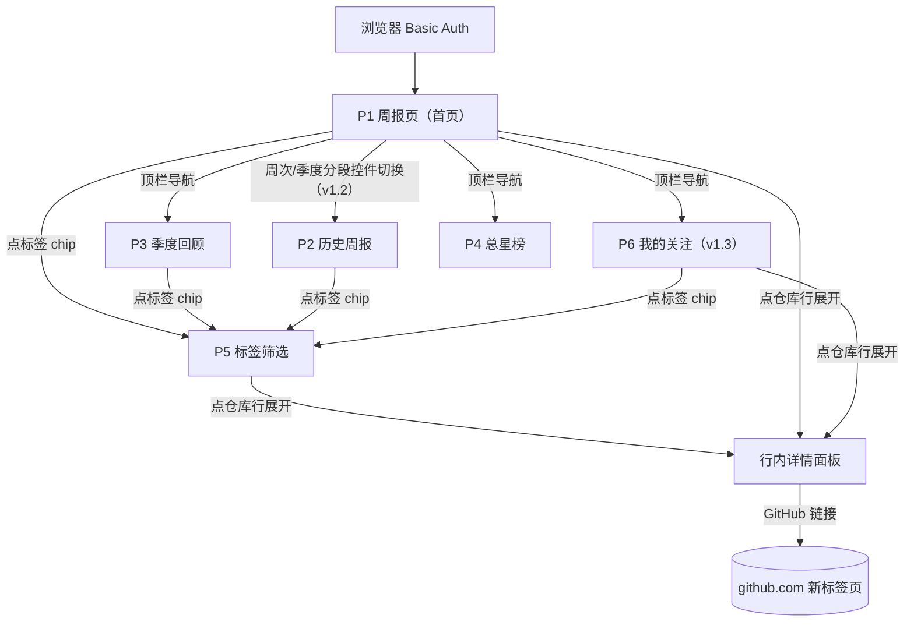
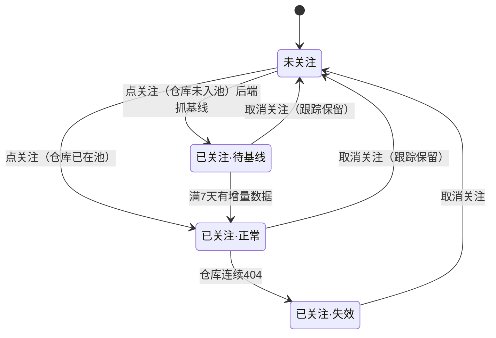
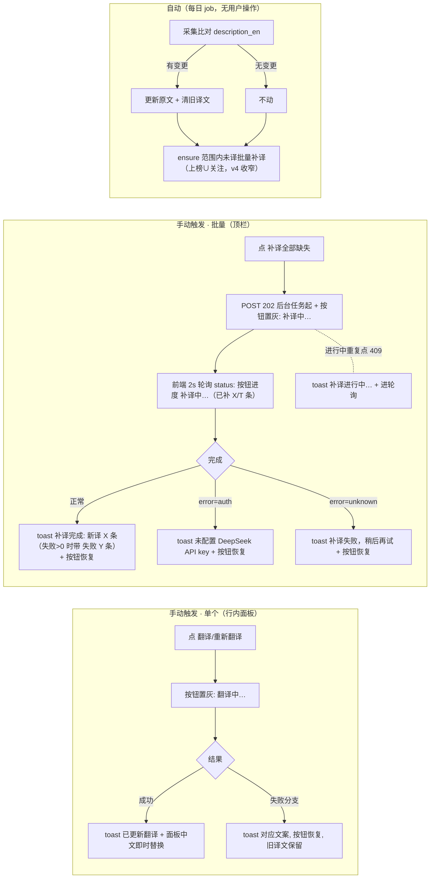
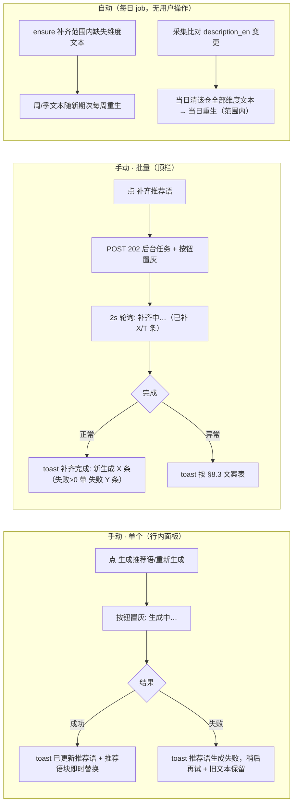

# 交互流程说明（阶段③前置冻结物）

> 确认状态：**已确认**　确认日期：2026-08-12　版本：v2.0　基线：dev-sop v1.4（§6 设计取舍：紧凑行 / 单长页+锚点导航 / 默认展开 / 关注独立页（v1.3）。v1.1 修订：D1/D3 由"点击展开+手风琴一次一行"改为"默认全部展开+独立折叠"——快速扫读项目描述与推荐理由、免逐行点击，2026-08-09 本人拍板。v1.2 勘误（T-008 实现适配，2026-08-09 本人拍板三项）：① URL 形态改为 `/?week=`、`/quarter?quarter=`、`/total`（原 `/w/`、`/q/`、`/top`）；② P3 期次下拉改为分段控件（与 v3 示意图一致）；③ 窗口实际天数标注由元信息行改为行级面板——滑动窗口逐仓口径，行级更精确。v1.3 变更（2026-08-09 本人拍板）：D4 翻案——"我的关注"由周报页顶部区块改为独立页 P6＋顶栏导航入口（关注多个时顶部区块侵占首屏、横滚查看效率低）；关注页内按语言分组展示（不按主题分：同仓多主题会重复出现）；同日勘误：§2A 补组间排序口径——组间按组内最大当周增量降序。示意图 v4 已按 v1.3 改绘并确认（2026-08-09）。v1.4 追加（2026-08-10 本人确认）：§7 翻译增强（T-016）——手动单/批量触发交互＋自动重译路径；组件复用既有冻结视觉体系，免示意图。v1.5 修订（2026-08-11 本人 T-016 复验打回拍板）：§7 批量后台化＋按钮移顶栏＋进度可见。v1.6 追加（2026-08-11 本人确认）：§8 推荐语增强（T-017）——分维度展示/行内与顶栏生成按钮/自动补齐；§7 自动路径随共识 v4 收窄上榜∪关注。v1.7 修订（2026-08-12 本人 T-017 复验反馈）：§8.1 推荐语块标题带维度标识＋周/季 prompt 钉死必须明确写出当期增星数字（与总星"不引用数字"形成肉眼可辨差异）。v1.8 追加（2026-08-12 本人确认）：§9 新崛起区（T-018，决策 4 v2）；§10 端点快照日期展示（T-020，方案 A）；§11 AI 概要（T-024，决策 11）。v1.9 修订（2026-08-12 T-025 实施拍板留痕，待本人复验确认）：§7.4 采集变更检测扩展——追加 language/topics 漂移检测（T-025），仅 UPDATE repos 归类字段，不清译文不删推荐语。v2.0 追加（2026-08-13 本人拍板）：§12 左侧边栏导航（仅 P1/P2/P3，原顶部锚点 chips 区由边栏替代、吸收"主题 chips 换行"优化点；新视觉元素，原型确认后开发）＋P6 标签筛选（分类指向 B：按自定义标签筛选，A/C 已否）。）
> 规则：本说明是画图的书面依据——示意图/实现不得偏离已确认流程；画图中发现流程要改，先改本说明确认再改图。
> 覆盖功能：全部 5 个（周报浏览 / 关注 / 标签筛选 / 季度回顾 / 总星榜）。触发前置的原因：存在空态、权限、降级等多条分支路径。

## 0. 设计原则（ux-designer skill 应用摘要）
- **场景定义**：单人、每周一次、10~20 分钟扫读 200~400 个项目——设计目标是**信息发现效率**，不是展示完整度。
- **渐进披露（v1.1 修订）**：列表行紧凑扫读，详情面板**默认全部展开**、可单击独立折叠；拒绝 17 榜 × 30 张全字段卡片平铺（v1 示意图的失误，认知过载）。
- **每个操作有可见反馈**（<100ms 感知）：关注/打标即时状态变更 + toast；失败回滚原态并报错。
- **空态必须回答"接下来会发生什么"**：首期无周报、空筛选、无增量，各给明确预期。
- **导航 ≤5 项、当前位置常显**；禁用按钮必须给原因（tooltip），不做无解释禁用。

## 1. 页面清单与跳转关系（站点地图）

| 页面 | 路径 | 内容 | 备注 |
|------|------|------|------|
| P1 周报页（首页） | `/`（=最新一期） | 元信息行 → 锚点导航 → 语言榜 7 块 → 主题榜 10 块（v1.3：顶部关注区移出） | 首期无周报时降级为"初始总星榜+倒计时"（见 §4） |
| P2 历史周报 | `/?week=<周次>`（v1.2） | 同 P1，仅换期次 | 从 P1 周次切换进入 |
| P3 季度回顾 | `/quarter?quarter=<季度>`（v1.2） | 90 天增量榜，布局同 P1 榜单区 | 默认最新季度，分段控件回看往期（v1.2） |
| P4 总星榜 | `/total`（v1.2） | 总星数降序 Top N | 首期填充视图，之后备查 |
| P5 标签筛选 | `/tags` → `/tags/<tag>` | 全部标签云 → 该标签下项目列表 | 从任意标签 chip 进入 |
| P6 我的关注（v1.3 新增） | `/follows` | 关注仓库按语言分组（7 组）的项目行列表，行形态同榜单（紧凑行＋默认展开＋★可取消） | 从顶栏导航进入；当期周报口径的当周增量 |

跳转规则：顶栏 5 项（本周报告 / **我的关注**（v1.3，带计数徽标） / 季度回顾 / 总星榜 / 标签）全局常驻；无登录页（Basic Auth 浏览器原生弹窗）；GitHub 外链一律新标签页打开。

## 2. 周报页信息层级（P1，核心页面）

自上而下四层（v1.3：原第 2 层"我的关注"移出为独立页 P6）：

1. **元信息行**（一行小字）：统计窗口、生成时间、跟踪池规模；窗口异常（滑动取数）时在**行级面板**标注实际天数（v1.2：滑动窗口是逐仓口径，行级比元信息行单值更精确）。
2. **左侧边栏导航**（v2.0，T-021：原顶部两排锚点 chips 改为左侧边栏，口径详见 §12.1）：语言榜 7 项＋主题榜 10 项分组陈列（各标榜内项目数），点击平滑滚动到对应榜；sticky 常驻、可收起且状态本地记住。
3. **榜单区**：每榜一个块，榜头 = 分类名 + 实际数量（不足 30 标实际值）（v2.0 起不再含"回顶部"链接——边栏 sticky 常驻后冗余，T-021；无边栏页面保留）。
4. **项目行（关键设计）**：默认**紧凑单行**——`排名 | 仓库名 | 语言徽标 | +N 本周 | ★总星 | ☆`。**详情面板默认全部展开**（v1.1 修订）：英文原文、中文描述、推荐理由、标签编辑区、GitHub 链接；单击行独立折叠/再展开（不再是手风琴一次一行）。

> 密度对比：紧凑行本身一屏可扫 12~15 行（v1 卡片一屏 2~3 张）；默认展开后单屏行数下降，但免除逐行点击（17 榜 × 30 行 ≈ 510 次），配合锚点 chips 直达消化页面变长，扫读效率仍是发现式阅读的第一指标（v1.1 本人拍板取舍）。

## 2A. 我的关注页信息层级（P6，v1.3 新增）

自上而下三层：

1. **元信息行**（一行小字）：当期周报的统计窗口口径（与 P1 当期一致）；关注总数。
2. **标签筛选行**（v2.0，T-021 分类指向 B，口径详见 §12.2）：我的全部标签 chips＋"全部"，点击筛出该标签下的关注仓；筛选不是分组，行不重复。
3. **分组区**：关注仓库**按语言分组**（Java/Go/Rust/TypeScript/JavaScript/Python/其它，共 7 组；每组一个块，块头 = 语言名 + 组内数量；空组不渲染）。**只按语言分、不按主题分**（v1.3 取舍：一个仓库可属多个主题，按主题分组会同仓重复出现；语言每仓唯一归属，列表无重复）。组间按**组内最大当周增量降序**（v1.3 同日勘误，2026-08-09 本人确认：最热的组在最前）。
4. **项目行**：形态与 P1 榜单行完全一致（紧凑行＋详情默认展开＋标签区＋★）；组内按**当周增量降序**（与当期周报同窗口口径；无增量数据的新关注排组尾并标"—— 下周起有数据"；dead 仓库灰显标"已失效"并沉组尾）。行内点 ★ → 取消关注，该行即时从页面移除。

## 3. 主路径逐步序列

### 3.1 每周阅读（功能 1）
1. 访问域名 → 浏览器弹 Basic Auth → 通过 → 系统渲染 P1。
2. 想先看自己盯的项目 → 顶栏点"我的关注"（带计数徽标）→ P6 按语言分组扫读当周变化（v1.3）。
3. 回 P1 沿榜单区下扫，或用锚点 chip 直跳目标榜。
4. 项目行详情默认展开，滚动即读（中文描述 + 推荐理由）；不感兴趣的可单击折叠。
5. 想深入了解 → 点 GitHub 链接（新标签页）。
6. 想回看 → 周次/季度 ‹ › 分段控件（v1.2）→ 系统渲染 P2/P3 往期。

### 3.2 关注（功能 2）
1. 点行内 ☆ → 系统写关注记录；**若仓库未入池：后端即时抓一次基线快照并加入每日跟踪池**。
2. 行内 ☆ 变 ★ + toast"已关注"；顶栏"我的关注"计数徽标 +1（前端局部更新，无需刷新）；该仓库可在 P6 查看（未入池者标"—— 下周起有数据"）。
3. 再点 ★（任意页面的行内星标）→ 取消关注 + toast"已取消关注（跟踪保留）"；计数徽标 -1；**跟踪保留**（不踢出池）。在 P6 内取消的，该行即时从页面移除。
4. 失败（网络异常/仓库 404）：toast 报错，星标回滚原态，计数不变。

### 3.3 打标与筛选（功能 3）
1. 展开项目行 → 标签区点"＋"→ 出现输入框 → 输入回车 → 新 chip 出现 + toast。
2. 点 chip 的 × → 删除该标签 + toast。
3. 点任一 chip → 跳 P5 该标签结果页（紧凑行列表，可同样展开）。
4. 输入约束：1~20 字符、去首尾空格；同仓库同名标签 → 不重复写入，toast"标签已存在"。

### 3.4 季度回顾 / 总星榜（功能 4/5）
1. 顶栏点对应 tab → P3/P4；布局与交互同 P1 榜单区（行展开、关注、打标均可用）。
2. P3 分段控件回看往期（v1.2）；P4 无期次概念。

## 4. 分支与异常（空态 / 错误 / 权限 / 边界）

| 情形 | 走向 |
|------|------|
| **首期无周报**（部署 0~7 天） | P1 降级显示总星榜 + 顶部倒计时条："首份周报将于 M月D日 生成，当前为初始总星榜" |
| **榜单不足 30** | 榜头标实际数量（如"Top 17"），不补位、不跳过 |
| **采集空洞**（连续失败 ≤3 天） | 不报警；行级面板标注实际天数（v1.2，滑动窗口逐仓口径）："实际窗口 9 天（取最近可得两端快照）" |
| **AI 降级** | 无翻译 → 只显英文原文；无推荐语 → 该行无推荐语块（不留空框）；榜单照常生成 |
| **新入池首周** | 不满最小窗口不出现在主榜，进入该榜块"新崛起区"（v1.8 §9：周<5 天/季<86 天，在池增量降序 Top 10，标注"入池 N 天增 X"）；若在关注列表，P6 该行仍标"—— 下周起有数据"并排组尾（v1.3） |
| **dead 仓库**（连续 404） | 从各榜剔除；已关注的在 P6 灰显 + "已失效"标并沉组尾（v1.3） |
| **空关注列表**（v1.3 新增） | P6 空态："还没有关注任何项目：去榜单点行右侧 ☆，该项目每周增量会出现在这里"，附回首页链接 |
| **Basic Auth 失败** | 浏览器原生 401，无应用内页面（鉴权完全外包给 Caddy） |
| **周次边界** | 最早一期禁用"‹上一周"、最新一期禁用"下一周›"，tooltip 说明"已是第X期/最新一期" |
| **空标签筛选** | P5 空态："还没有项目打过「xx」标签"，附返回链接 |
| **标签输入非法**（空/超 20 字符） | 不提交，输入框红边 + 内联提示 |

## 5. 状态流转

报告生命周期（无需用户操作，仅作口径记录）：累计中（不满 7 天，不可见）→ 每周日生成 → 当期报告 →（新一期生成）→ 往期报告。

## 6. 待本人拍板的设计取舍

| # | 取舍点 | 我的推荐 | 备选 |
|---|--------|----------|------|
| D1 | 项目条目默认形态 | **紧凑行+详情默认展开**（v1.1：免逐行点击，扫读即读描述与推荐理由） | 卡片平铺（v1 做法，信息全但慢）、点击展开（v1 做法，≈510 次点击成本） |
| D2 | 17 榜的组织 | **单长页 + 锚点 chip 导航**（阅读流不中断） | 每榜独立分页（导航深、来回跳） |
| D3 | 展开方式 | **默认全开+独立折叠**（v1.1：配合 D1 默认展开；页面跳动由锚点直达消化） | 手风琴一次一行（v1 做法，与快速浏览冲突） |
| D4 | 我的关注位置 | **独立页 P6＋顶栏导航入口，页内按语言分组**（v1.3 本人拍板变更：关注多个时顶部区块侵占首屏、横滚效率低；分组后按类查看） | 固定在周报页顶部（v1~v1.2 口径，T-008/T-009 已实现，v1.3 翻案）；按主题分组（同仓多主题会重复出现，弃） |

---

## 7. 翻译增强（T-016 追加，v1.5，2026-08-11 本人复验打回后修订）

> 变更注记（v1.5，2026-08-11）：本人 T-016 复验打回拍板——按钮页脚→顶栏＋批量进度可见（设计缺陷修复，实现对齐共识§7"后台执行"）。
> 需求来源：共识 §7 v3（2026-08-10 本人拍板）——全池覆盖＋原文变更自动重译＋手动单/批量触发；v4（2026-08-11 本人拍板）——自动补译/批量补译范围收窄**上榜∪关注**（手动单个不受限），推荐语见 §8。
> 组件分档：行内小按钮与 toast 均为既有冻结视觉体系组件复用，免示意图（2026-08-09 分档口径）；文字层本草稿确认后开发。

### 7.1 元素与位置
- **行内翻译按钮**：行内详情面板标签区右侧（"＋ 标签"按钮旁）。文案按态：无译文显 **"翻译"**，已有译文显 **"重新翻译"**。
- **批量按钮**：顶栏右端（全页面共用顶栏），文字钮 **"补译全部缺失"**。
- 自动路径无界面元素。

### 7.2 主路径逐步序列
**单个重译（场景：看到英文/译文陈旧/译得差，立即自救）**
1. 展开任意项目行 → 点"翻译/重新翻译" → 按钮置灰变"翻译中…"（防连点）。
2. 服务端 `POST /api/translate`（强制重译，覆盖现值）→ 成功：toast"已更新翻译"，面板中文描述即时局部替换（不刷新页面）；按钮恢复按态文案。

**批量补译（场景：发现多处英文，一次补齐；后台任务执行——POST 202 立即返回，前端 2s 轮询进度）**
1. 顶栏点"补译全部缺失" → 按钮置灰变"补译中…"（后台任务已起，POST 202 立即返回，不在请求内跑完）。
2. 前端每 2s 轮询 `/api/translate-missing/status` → 按钮进度文案"补译中…（已补 X/T 条）"（T=0 时保持"补译中…"）；页面加载时若任务在跑，自动接管进度显示。
3. 完成：toast"补译完成：新译 X 条"（有失败条时"补译完成：新译 X 条，失败 Y 条"），按钮恢复"补译全部缺失"。

### 7.3 分支与异常
| 场景 | 走向 |
|---|---|
| 单个：无英文简介 | toast"无简介可译"，按钮恢复 |
| 单个：原文含中文 | toast"原文已是中文，无需翻译"，按钮恢复 |
| 单个：AI/网络失败 | toast"翻译失败，稍后再试"；**旧译文保留不变**，按钮恢复 |
| 批量：进行中（按钮态） | 按钮文案"补译中…（已补 X/T 条）"（T=0 时保持"补译中…"），置灰防连点 |
| 批量：进行中重复点击 | toast"补译进行中…"（服务端 running 态 409），进轮询接管进度 |
| 批量：任务完成 | toast"补译完成：新译 X 条"；失败 Y 条＞0 时"补译完成：新译 X 条，失败 Y 条"；按钮恢复"补译全部缺失" |
| 批量：DeepSeek key 未配置 | toast"未配置 DeepSeek API key"（后台任务 error="auth" 终止整批，已译保留） |
| 批量：后台任务异常/网络失败 | toast"补译失败，稍后再试"（后台任务 error="unknown"；前端网络层失败同文案） |
| 自动：采集比对无变更 | 不动原文不动译文 |
| 自动：单条翻译失败 | 记日志跳过，次日再试（与 T-011 降级链同口径） |

### 7.4 服务端口径（钉死）
- 单个重译＝**强制**（不管现值，覆盖写库）；批量补译＝**只补 NULL**；两者都不触碰推荐理由表。
- 采集变更检测覆盖 description_en 与 language/topics 漂移（T-025 起）；language/topics 漂移仅 UPDATE repos 归类字段，不清译文不删推荐语（归类读时实时算自然生效；漂移率低重生成本高）。
- 全部翻译写操作幂等可重入；失败永不阻塞榜单渲染与每日快照主流程。

---

## 8. 推荐语增强（T-017 追加，v1.6，2026-08-11 本人确认）

> 需求来源：共识 §7 v4＋架构决策 6 v2（2026-08-11 本人拍板确认）——推荐语**三口径分维度**＋覆盖**上榜∪关注**＋手动单/批量触发＋输入含 README 正文（截断）；关注页/关注集总星维度；总星文本按 README 变更当日重生。
> 组件分档：行内小按钮/顶栏文字钮/toast/后台进度均为既有冻结视觉体系组件复用（与翻译同构、并列不共用），免示意图；本草稿本人确认后开发。

### 8.1 维度与展示规则
- 推荐语按**榜单维度**各生一条：周文本/季文本（增量语境，输入含当期增量）；总星文本（存量语境"是什么＋领域地位"，**不引用具体星数/排名数字**——数字由行内数据展示，防 evergreen 陈旧）。
- 分化钉死（v1.7，2026-08-12 本人复验反馈"周和总星推荐语没差别"）：周/季 prompt 有增量时**必须明确写出当期增星数字**（"本周/本季新增 X 星"），与总星"不引用数字"形成肉眼可辨的稳定差异。
- **推荐语块标题带维度标识**（v1.7）：`周榜推荐语 · {期次}`／`季榜推荐语 · {期次}`／`总星榜推荐语`——一眼可辨该文本属三维度中的哪套；首期空态降级页面上同时解释"当前展示的是总星榜文本"。
- 展示映射：周报页行→周文本（当期周标签）；季度回顾页行→季文本（当期季标签）；总星榜行→总星文本（最新一条）；我的关注页行→总星文本（最新一条——关注页是长期盯梢语境非热点语境，周文本对低增量仓牵强且每周重刷纯 churn，2026-08-11 复验讨论修订）。无对应文本 → 该行无推荐语块（降级，榜单照常出）。

### 8.2 元素与位置
- **行内推荐语按钮**：行内详情面板翻译按钮旁（并列）。文案按态：无当前页维度推荐语显 **"生成推荐语"**，已有显 **"重新生成"**；只在有推荐语展示位的页面（周/季/总星/关注四页）出现，按当前页维度操作。
- **批量推荐语按钮**：顶栏右端"补译全部缺失"旁，文字钮 **"补齐推荐语"**。
- 自动路径无界面元素。

### 8.3 分支与异常（与翻译同构，文案逐字）
| 场景 | 走向 |
|---|---|
| 单个：进行中 | 按钮置灰"生成中…"（防连点） |
| 单个：成功 | toast"已更新推荐语"，推荐语块即时局部替换（不刷新页面）；按钮恢复按态文案 |
| 单个：AI/网络失败 | toast"推荐语生成失败，稍后再试"（err）；**旧文本保留**，按钮恢复 |
| 批量：进行中（按钮态） | "补齐中…（已补 X/T 条）"（T=0 保持"补齐中…"），置灰；页面加载时任务在跑自动接管进度 |
| 批量：进行中重复点击 | toast"补齐进行中…"（409），进轮询接管 |
| 批量：任务完成 | toast"补齐完成：新生成 X 条"；失败 Y 条＞0 时"补齐完成：新生成 X 条，失败 Y 条"；按钮恢复"补齐推荐语" |
| 批量/单个：DeepSeek key 未配置 | toast"未配置 DeepSeek API key"（err） |
| 批量：任务异常/网络失败 | toast"补齐失败，稍后再试"（err） |
| 自动：单条生成失败 | 记日志跳过，次日补缺（与翻译降级链同口径） |

### 8.4 服务端口径（钉死）
- 单个＝**强制重生**（按当前页维度，新文本覆盖同维度当期）；批量＝**只补缺失**（范围内 × 适用维度）。翻译表与其他表不动。
- 覆盖：三口径榜 Top30 去重 ∪ 关注集；关注未上榜仓只生总星维度（供关注页展示）。
- 自动：每日 ensure 补缺（缺各维度文本）；周/季文本随新期次每周重生（季文本季内每周 REPLACE 当季行）；**README 变更（blob sha 指纹每日比对）→ 当日重生总星文本**（周/季不随此触发；行存 readme_sha，NULL 仓后续出现 README 视为变更自愈）；简介变更 → 当日清该仓全部维度文本＋当日重生（范围内）。
- 输入：**README 正文**（GitHub API 拉取、截断入 prompt；空 README/拉取失败 → 退化元数据输入；不持久化——2026-08-11 本人提出，覆盖仅上榜∪关注量级小）＋仓库名/简介/语言/topics/当期增量/总星数等元数据；总星维度 prompt 不引用具体数字。
- 失败永不阻塞榜单渲染与每日快照主流程（降级：该行无推荐语块）。

---

## 9. 新崛起区（T-018 追加，v1.8，2026-08-12 本人确认）

> 需求来源：《架构决策记录》决策 4 v2（2026-08-12 本人拍板）——季榜最小窗口 86 天致新项目近 3 个月全盲、周榜 5 天同病；选 A 方案（分区展示不混排）＋周榜同构。
> 组件分档：区头/榜单行/小字说明全复用既有冻结视觉体系组件，免示意图（2026-08-09 分档口径）；本草稿本人确认后开发。

### 9.1 位置与元素
- P1 周报页/P3 季度回顾的**每个分类榜块内**，主榜行之后追加"新崛起区"小节；P4 总星榜（无增量概念）、P6 我的关注（页语义不变）不设新区。
- 区头：`新崛起 · 入池未满一个统计窗口`＋一行小字说明——周榜页"以下项目入池不足 7 天，按入池以来增星排序"，季榜页"以下项目入池不足 90 天，按入池以来增星排序"；区头计数徽标同榜头形态（不足 10 标实际值）。
- 行形态与主榜行完全一致（紧凑行＋详情默认展开＋翻译/推荐语/标签/★）；**增量列显示 `+X（入池 N 天）`**——在池增量非窗口增量，标注区别于主榜防误读。

### 9.2 主路径与分支
- 空区不渲染：该榜块无新区成员时不出现区头与说明（榜块本体照常）。
- 毕业：在池跨度满最小窗口（周 5 天/季 86 天）当期起出席主榜、自动离开新区，无用户感知事件。
- AI 覆盖沿用上榜∪关注：新区行翻译/推荐语同主榜行（周榜新区→周维度文本、季榜新区→季维度文本；行内按钮按当前页维度操作）；推荐语 prompt 增量语境为"入池 N 天增 X 星"（区别于主榜窗口增量语境）。

### 9.3 服务端口径（钉死）
- 准入：主榜出席校验失败（在池跨度不足最小窗口）且有端点快照的仓；在池增量＝端点星数 − 入池基线快照（该仓最旧一张）星数；在池天数＝两端间隔（天）。
- 排序：在池增量降序（负增量沉底同主榜）；dead 剔除同主榜；每区 Top 10。
- 新区混有"GitHub 新项目"与"新入池老仓翻红"（repos 无 GitHub 创建时间字段，不区分、不加字段）。

## 10. 端点快照日期展示（T-020 追加，v1.8，2026-08-12 本人拍板方案 A）

- 行详情面板元信息处（窗口天数标注旁）追加端点快照日期标注：`端点快照 YYYY-MM-DD`；每行可见，个别仓端点陈旧一眼可辨。
- 纯展示层变更，无计算口径变更；共用行模板的全页面（P1/P2/P3/P4/P5/P6）同步生效。

## 11. AI 概要（T-024 追加，v1.8，2026-08-12 本人拍板形态）

> 需求来源：《架构决策记录》决策 11（2026-08-12 本人拍板）——详情面板 AI 概要，与推荐语并存不替代。

### 11.1 位置与元素
- 行详情面板推荐语块下方新增"AI 概要"块：段落级 3~5 句中文，README 文档视角"是什么/怎么组成"。
- 与推荐语并存：推荐语＝为什么值得关注（营销视角，三维度分榜）；概要＝是什么（文档视角，无维度概念，全页面同一条）。
- 无手动按钮（行内已有翻译/推荐语两钮；概要无"立即要"场景——复验如需再加）。

### 11.2 服务端口径（钉死）
- 覆盖：上榜∪关注（同决策 5 v3/决策 6 v2 口径）。
- 节奏：懒生成（缺时每日 ensure 补）＋README 变更（readme_sha 指纹每日比对）当日重生——复用决策 6 v2 链路。
- 存储：复用 recommendations 表新增 dimension 值（实施时定；动 schema CHECK 约束需幂等迁移）。
- 降级：无概要 → 该行无概要块（不留空框），榜单照常出；AI 失败永不阻塞出榜。

---

## 12. 左侧边栏导航＋P6 标签筛选（T-021 追加，v2.0，2026-08-13 本人拍板）

> 需求来源：想法池归档两条（2026-08-09 本人 T-008/T-015 走查提出）合并立项 T-021；分类指向 2026-08-13 本人拍板选 B（按自定义标签筛选，A 按主题分组/C 导航入口已否——A 撞 v1.3"同仓多主题重复出现"否决理由，C 本质是导航被边栏吸收）。

### 12.1 左侧边栏导航（仅 P1/P2/P3 榜单三页）
- 范围：仅榜单三页（本周/历史周/季度，共用榜单布局）；P4/P5/P6 页面较浅不设边栏。
- 形态：桌面端左侧 sticky 边栏常驻，内容两组——语言榜 7 项、主题榜 10 项（各标榜内项目数；**边栏项顺序与页面榜块顺序一致**，主题名以 config/topics.yaml 为准）；点击平滑滚动直达对应榜。**边栏不放"回顶部"项、榜单三页各榜头的"回顶部"链接同步移除**（2026-08-13 本人拍板：边栏 sticky 常驻后回顶部入口冗余；P4/P5/P6 无边栏页面的榜头回顶部保留不动）。
- 原顶部"榜单直达"锚点 chips 区由边栏**替代**，不再保留（一并吸收"主题 chips 换行展示"优化点：边栏纵向分组天然分行，语言/主题不再紧凑同行）。
- 收起：边栏可收起为一细条（留展开钮）；收起/展开状态本地记住（localStorage），跨会话保持。
- 移动端（窄屏）：边栏默认收起，悬浮按钮展开为抽屉，点选后自动收回。
- 开发门禁：新视觉元素，先出同保真原型本人确认再开发（原型文件 docs/sop/原型-T021.html）。

### 12.2 P6 标签筛选（分类指向 B）
- 位置：P6 元信息行与分组区之间新增"标签筛选行"——我的全部标签 chips（按标签名字典序）＋"全部"。
- 行为：点某标签 → 分组区只显示该标签下的关注仓（分组结构、组间/组内排序口径不变，仅行集收窄）；再点当前标签或"全部" → 取消筛选。
- 筛选不是分组：一仓可有多标签，任何时刻行在页面上只出现一次（v1.3"语言分组无重复"口径不破）。
- 空态：该标签下无关注仓 → 明确文案（"该标签下暂无关注项目"），不留空架。
