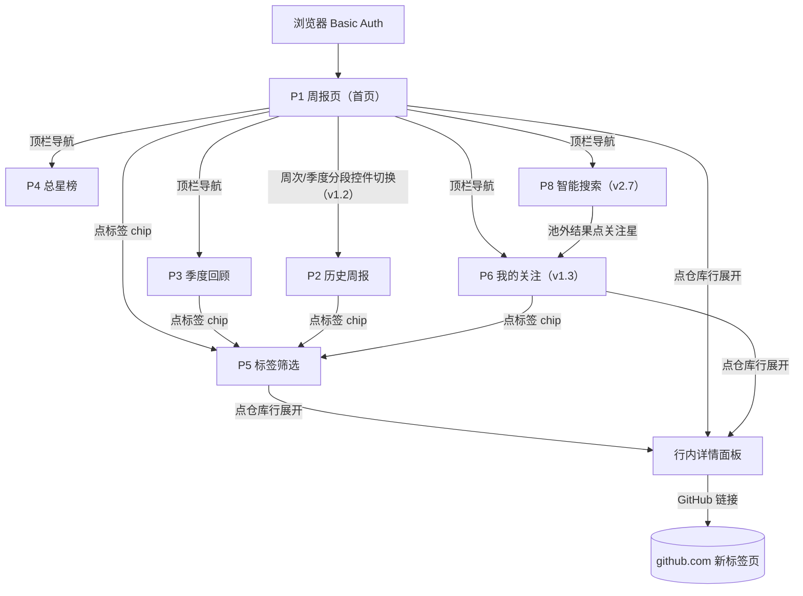
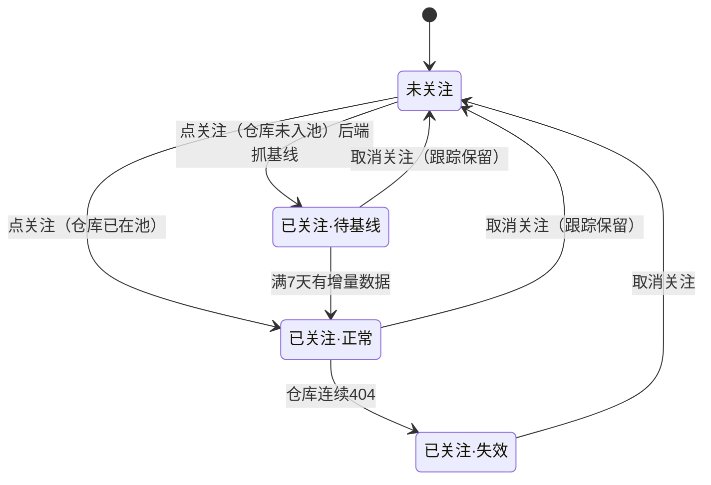

# 交互流程说明（阶段③前置冻结物）

> 确认状态：**已确认**　确认日期：2026-08-19　版本：v2.9　基线：dev-sop v1.4（§6 设计取舍：紧凑行 / 单长页+锚点导航 / 默认展开 / 关注独立页（v1.3）。）
> 规则：本说明是画图的书面依据——示意图/实现不得偏离已确认流程；画图中发现流程要改，先改本说明确认再改图。
> 覆盖功能：全部 5 个（周报浏览 / 关注 / 标签筛选 / 季度回顾 / 总星榜）。触发前置的原因：存在空态、权限、降级等多条分支路径。
> 沿革：拆分前版本沿革见 归档/交互流程说明-沿革.md；各专章版本见各文件标题。

## 0. 设计原则（ux-designer skill 应用摘要）
- **场景定义**：单人、每周一次、10~20 分钟扫读 200~400 个项目——设计目标是**信息发现效率**，不是展示完整度。
- **渐进披露（v1.1 修订）**：列表行紧凑扫读，详情面板**默认全部展开**、可单击独立折叠；拒绝 17 榜 × 30 张全字段卡片平铺（v1 示意图的失误，认知过载）。
- **每个操作有可见反馈**（<100ms 感知）：关注/打标即时状态变更 + toast；失败回滚原态并报错。
- **空态必须回答"接下来会发生什么"**：首期无周报、空筛选、无增量，各给明确预期。
- **导航 ≤5 项、当前位置常显**；禁用按钮必须给原因（tooltip），不做无解释禁用。

## 1. 页面清单与跳转关系（站点地图）

| 页面 | 路径 | 内容 | 备注 |
|------|------|------|------|
| P1 周报页（首页） | `/`（=最新一期） | 元信息行 → 锚点导航 → 语言榜 7 块 → 主题榜 10 块（v1.3：顶部关注区移出） | 首期无周报时降级为"初始总星榜+倒计时"（见 §4） |
| P2 历史周报 | `/?week=<周次>`（v1.2） | 同 P1，仅换期次 | 从 P1 周次切换进入 |
| P3 季度回顾 | `/quarter?quarter=<季度>`（v1.2） | 90 天增量榜，布局同 P1 榜单区 | 默认最新季度，分段控件回看往期（v1.2） |
| P4 总星榜 | `/total`（v1.2） | 总星数降序 Top N | 首期填充视图，之后备查 |
| P5 标签筛选 | `/tags` → `/tags/<tag>` | 全部标签云 → 该标签下项目列表 | 从任意标签 chip 进入 |
| P6 我的关注（v1.3 新增） | `/follows` | 关注仓库按语言分组（7 组）的项目行列表，行形态同榜单（紧凑行＋默认展开＋★可取消） | 从顶栏导航进入；当期周报口径的当周增量 |
| P7 候选词（v2.6） | `/topic-candidates` | 每周候选词只读列表 | 从 P1 元信息行小字链接进入，不占顶栏 |
| P8 智能搜索（v2.8） | `/search` | 自然语言输入框 → 推荐结果列表（池内精选 20 条＋池外补搜，行复用榜单行组件＋推荐理由） | 从顶栏导航进入；池外结果带"池外"徽标＋关注星 |

跳转规则：顶栏 6 项（本周报告 / **我的关注**（v1.3，带计数徽标） / 季度回顾 / 总星榜 / 标签 / **搜索**（v2.7，顶栏上限由 5 调整为 6））全局常驻；无登录页（Basic Auth 浏览器原生弹窗）；GitHub 外链一律新标签页打开。

## 2. 周报页信息层级（P1，核心页面）

自上而下四层（v1.3：原第 2 层"我的关注"移出为独立页 P6）：

1. **元信息行**（一行小字，T-028 消歧）：统计窗口、数据截至（库内最新快照的北京日期）、每日 05:00 采集（v2.3 改定：去 UTC 括注）、页面渲染时刻、跟踪池规模、口径说明——原"生成于"实为渲染时刻、易误读为数据时间，拆为"数据截至／页面渲染于"两段；窗口异常（滑动取数）时在**行级面板**标注实际天数（v1.2：滑动窗口是逐仓口径，行级比元信息行单值更精确）。
2. **左侧边栏导航**（v2.0，T-021：原顶部两排锚点 chips 改为左侧边栏，口径详见 §12.1）："全部"项＋语言榜 7 项＋主题榜 10 项分组陈列（各标榜内项目数），点击整页导航到对应单榜（v2.1 §13.1：原页内平滑滚动锚点改为 `?board=` 整页链接）；sticky 常驻、可收起且状态本地记住。
3. **榜单区**：每榜一个块，榜头 = 分类名 + 实际数量（不足 30 标实际值）（v2.0 起不再含"回顶部"链接——边栏 sticky 常驻后冗余，T-021；v2.1 起榜单四页均有边栏，榜头回顶部全移除，P5/P6 本不涉及）。
4. **项目行（关键设计）**：默认**紧凑单行**——`排名 | 仓库名 | 语言徽标 | +N 本周 | ★总星 | ☆`。**详情面板默认全部展开**（v1.1 修订）：英文原文、中文描述、推荐理由、标签编辑区、GitHub 链接；单击行独立折叠/再展开（不再是手风琴一次一行）。

> 密度对比：紧凑行本身一屏可扫 12~15 行（v1 卡片一屏 2~3 张）；默认展开后单屏行数下降，但免除逐行点击（17 榜 × 30 行 ≈ 510 次），配合锚点 chips 直达消化页面变长，扫读效率仍是发现式阅读的第一指标（v1.1 本人拍板取舍）。

## 2A. 我的关注页信息层级（P6，v1.3 新增）

自上而下三层：

1. **元信息行**（一行小字）：当期周报的统计窗口口径（与 P1 当期一致）；关注总数。
2. **标签筛选行**（v2.0，T-021 分类指向 B，口径详见 §12.2）：我的全部标签 chips＋"全部"，点击筛出该标签下的关注仓；筛选不是分组，行不重复。
3. **分组区**：关注仓库**按语言分组**（Java/Go/Rust/TypeScript/JavaScript/Python/其它，共 7 组；每组一个块，块头 = 语言名 + 组内数量；空组不渲染）。**只按语言分、不按主题分**（v1.3 取舍：一个仓库可属多个主题，按主题分组会同仓重复出现；语言每仓唯一归属，列表无重复）。组间按**组内最大当周增量降序**（v1.3 同日勘误，2026-08-09 本人确认：最热的组在最前）。
4. **项目行**：形态与 P1 榜单行完全一致（紧凑行＋详情默认展开＋标签区＋★）；组内按**当周增量降序**（与当期周报同窗口口径；无增量数据的新关注排组尾并标"—— 下周起有数据"；dead 仓库灰显标"已失效"并沉组尾）。行内点 ★ → 取消关注，该行即时从页面移除。

## 3. 主路径逐步序列

### 3.1 每周阅读（功能 1）
1. 访问域名 → 浏览器弹 Basic Auth → 通过 → 系统渲染 P1。
2. 想先看自己盯的项目 → 顶栏点"我的关注"（带计数徽标）→ P6 按语言分组扫读当周变化（v1.3）。
3. 回 P1 沿榜单区下扫，或用锚点 chip 直跳目标榜。
4. 项目行详情默认展开，滚动即读（中文描述 + 推荐理由）；不感兴趣的可单击折叠。
5. 想深入了解 → 点 GitHub 链接（新标签页）。
6. 想回看 → 周次/季度 ‹ › 分段控件（v1.2）→ 系统渲染 P2/P3 往期。

### 3.2 关注（功能 2）
1. 点行内 ☆ → 系统写关注记录；**若仓库未入池：后端即时抓一次基线快照并加入每日跟踪池**。
2. 行内 ☆ 变 ★ + toast"已关注"；顶栏"我的关注"计数徽标 +1（前端局部更新，无需刷新）；该仓库可在 P6 查看（未入池者标"—— 下周起有数据"）。
3. 再点 ★（任意页面的行内星标）→ 取消关注 + toast"已取消关注（跟踪保留）"；计数徽标 -1；**跟踪保留**（不踢出池）。在 P6 内取消的，该行即时从页面移除。
4. 失败（网络异常/仓库 404）：toast 报错，星标回滚原态，计数不变。

### 3.3 打标与筛选（功能 3）
1. 展开项目行 → 标签区点"＋"→ 出现输入框 → 输入回车 → 新 chip 出现 + toast。点"＋"出现输入框时下方建议下拉**直接列出既有标签**（按使用次数降序，最多 8 条），输入时再子串过滤收窄；点选即提交（v2.9，桌面端 ↑/↓＋回车可选）；无匹配时下拉不显示，不影响照常创建新标签。
2. 点 chip 的 × → 删除该标签 + toast。
3. 点任一 chip → 跳 P5 该标签结果页（紧凑行列表，可同样展开）。
4. 输入约束：1~20 字符、去首尾空格；同仓库同名标签 → 不重复写入，toast"标签已存在"。

### 3.4 季度回顾 / 总星榜（功能 4/5）
1. 顶栏点对应 tab → P3/P4；布局与交互同 P1 榜单区（行展开、关注、打标均可用）。
2. P3 分段控件回看往期（v1.2）；P4 无期次概念。

## 4. 分支与异常（空态 / 错误 / 权限 / 边界）

| 情形 | 走向 |
|------|------|
| **首期无周报**（部署 0~7 天） | P1 降级显示总星榜 + 顶部倒计时条："首份周报将于 M月D日 生成，当前为初始总星榜" |
| **榜单不足 30** | 榜头标实际数量（如"Top 17"），不补位、不跳过 |
| **采集空洞**（连续失败 ≤3 天） | 不报警；行级面板标注实际天数（v1.2，滑动窗口逐仓口径）："实际窗口 9 天（取最近可得两端快照）" |
| **AI 降级** | 无翻译 → 只显英文原文；无推荐语 → 该行无推荐语块（不留空框）；榜单照常生成 |
| **新入池首周** | 不满最小窗口不出现在主榜，进入该榜块"新崛起区"（v1.8 §9：周<5 天/季<86 天，在池增量降序 Top 10，标注"入池 N 天增 X"）；若在关注列表，P6 该行仍标"—— 下周起有数据"并排组尾（v1.3） |
| **dead 仓库**（连续 404） | 从各榜剔除；已关注的在 P6 灰显 + "已失效"标并沉组尾（v1.3） |
| **空关注列表**（v1.3 新增） | P6 空态："还没有关注任何项目：去榜单点行右侧 ☆，该项目每周增量会出现在这里"，附回首页链接 |
| **Basic Auth 失败** | 浏览器原生 401，无应用内页面（鉴权完全外包给 Caddy） |
| **周次边界** | 最早一期禁用"‹上一周"、最新一期禁用"下一周›"，tooltip 说明"已是第X期/最新一期" |
| **空标签筛选** | P5 空态："还没有项目打过「xx」标签"，附返回链接 |
| **标签输入非法**（空/超 20 字符） | 不提交，输入框红边 + 内联提示 |

## 5. 状态流转

报告生命周期（无需用户操作，仅作口径记录）：累计中（不满 7 天，不可见）→ 每周日生成 → 当期报告 →（新一期生成）→ 往期报告。

## 6. 待本人拍板的设计取舍

| # | 取舍点 | 我的推荐 | 备选 |
|---|--------|----------|------|
| D1 | 项目条目默认形态 | **紧凑行+详情默认展开**（v1.1：免逐行点击，扫读即读描述与推荐理由） | 卡片平铺（v1 做法，信息全但慢）、点击展开（v1 做法，≈510 次点击成本） |
| D2 | 17 榜的组织 | **单长页 + 锚点 chip 导航**（阅读流不中断） | 每榜独立分页（导航深、来回跳） |
| D3 | 展开方式 | **默认全开+独立折叠**（v1.1：配合 D1 默认展开；页面跳动由锚点直达消化） | 手风琴一次一行（v1 做法，与快速浏览冲突） |
| D4 | 我的关注位置 | **独立页 P6＋顶栏导航入口，页内按语言分组**（v1.3 本人拍板变更：关注多个时顶部区块侵占首屏、横滚效率低；分组后按类查看） | 固定在周报页顶部（v1~v1.2 口径，T-008/T-009 已实现，v1.3 翻案）；按主题分组（同仓多主题会重复出现，弃） |

---

## 专章索引

| 章号 | 专章文件 | 一句话内容 |
|---|---|---|
| §7 | 交互流程/07-翻译增强.md | 翻译增强：手动单/批量触发＋自动重译路径 |
| §8 | 交互流程/08-推荐语增强.md | 推荐语增强：分维度展示＋行内/顶栏生成按钮＋自动补齐 |
| §9 | 交互流程/09-新崛起区.md | 新崛起区：入池未满统计窗口的新仓分区展示 |
| §10 | 交互流程/10-端点快照日期展示.md | 端点快照日期展示：行详情面板标注端点快照日期 |
| §11 | 交互流程/11-AI概要.md | AI 概要：详情面板 AI 概要块（文档视角） |
| §12 | 交互流程/12-左侧边栏导航与P6标签筛选.md | 左侧边栏导航＋P6 标签筛选 |
| §13 | 交互流程/13-单榜整页与移动端行布局.md | 单榜整页（?board=）＋移动端榜单行两行布局 |
| §14 | 交互流程/14-手动同步.md | 手动同步：顶栏"立即同步"触发 daily_job 全链路 |
| §15 | 交互流程/15-候选词扫描与展示.md | 候选词扫描与展示：P7 只读列表 |
| §16 | 交互流程/16-榜单三段结构.md | 榜单三段结构：新项目区＋主榜区头＋创建年份标注 |
| §17 | 交互流程/17-智能搜索.md | 智能搜索：P8 自然语言意图→池内精选＋池外补搜 |

> 映射约定：全文（含其他文档）的 §N.M 引用中，§7~§17 指向 交互流程/ 目录下对应编号前缀的专章文件（如 "§12.1"＝交互流程/12-左侧边栏导航与P6标签筛选.md）；总纲内和各专章内的 § 交叉引用原文一律不改，按此约定定位。
