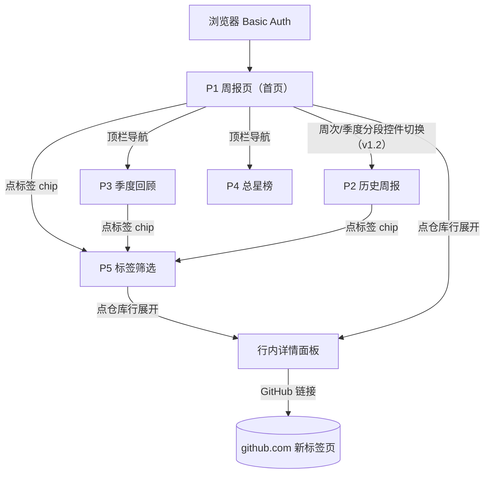
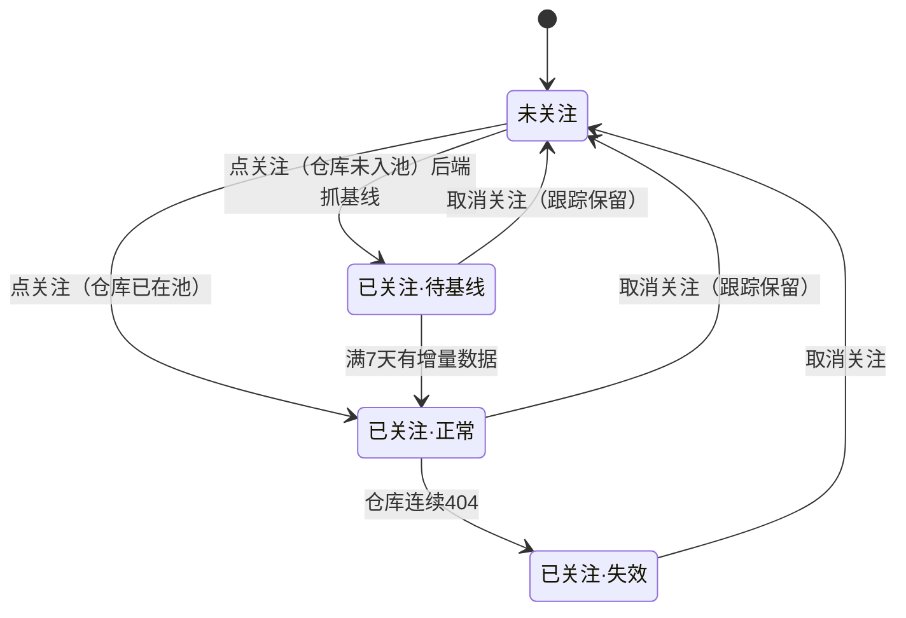

# 交互流程说明（阶段③前置冻结物）

> 确认状态：**已确认**　确认日期：2026-08-09　版本：v1.2　基线：dev-sop v1.4（§6 四项设计取舍：紧凑行 / 单长页+锚点导航 / 默认展开 / 关注区置顶。v1.1 修订：D1/D3 由"点击展开+手风琴一次一行"改为"默认全部展开+独立折叠"——快速扫读项目描述与推荐理由、免逐行点击，2026-08-09 本人拍板。v1.2 勘误（T-008 实现适配，2026-08-09 本人拍板三项）：① URL 形态改为 `/?week=`、`/quarter?quarter=`、`/total`（原 `/w/`、`/q/`、`/top`）；② P3 期次下拉改为分段控件（与 v3 示意图一致）；③ 窗口实际天数标注由元信息行改为行级面板——滑动窗口逐仓口径，行级更精确）
> 规则：本说明是画图的书面依据——示意图/实现不得偏离已确认流程；画图中发现流程要改，先改本说明确认再改图。
> 覆盖功能：全部 5 个（周报浏览 / 关注 / 标签筛选 / 季度回顾 / 总星榜）。触发前置的原因：存在空态、权限、降级等多条分支路径。

## 0. 设计原则（ux-designer skill 应用摘要）
- **场景定义**：单人、每周一次、10~20 分钟扫读 200~400 个项目——设计目标是**信息发现效率**，不是展示完整度。
- **渐进披露（v1.1 修订）**：列表行紧凑扫读，详情面板**默认全部展开**、可单击独立折叠；拒绝 17 榜 × 30 张全字段卡片平铺（v1 示意图的失误，认知过载）。
- **每个操作有可见反馈**（<100ms 感知）：关注/打标即时状态变更 + toast；失败回滚原态并报错。
- **空态必须回答"接下来会发生什么"**：首期无周报、空筛选、无增量，各给明确预期。
- **导航 ≤5 项、当前位置常显**；禁用按钮必须给原因（tooltip），不做无解释禁用。

## 1. 页面清单与跳转关系（站点地图）

| 页面 | 路径 | 内容 | 备注 |
|------|------|------|------|
| P1 周报页（首页） | `/`（=最新一期） | 元信息行 → 我的关注 → 锚点导航 → 语言榜 7 块 → 主题榜 10 块 | 首期无周报时降级为"初始总星榜+倒计时"（见 §4） |
| P2 历史周报 | `/?week=<周次>`（v1.2） | 同 P1，仅换期次 | 从 P1 周次切换进入 |
| P3 季度回顾 | `/quarter?quarter=<季度>`（v1.2） | 90 天增量榜，布局同 P1 榜单区 | 默认最新季度，分段控件回看往期（v1.2） |
| P4 总星榜 | `/total`（v1.2） | 总星数降序 Top N | 首期填充视图，之后备查 |
| P5 标签筛选 | `/tags` → `/tags/<tag>` | 全部标签云 → 该标签下项目列表 | 从任意标签 chip 进入 |

跳转规则：顶栏 4 项（本周报告 / 季度回顾 / 总星榜 / 标签）全局常驻；无登录页（Basic Auth 浏览器原生弹窗）；GitHub 外链一律新标签页打开。

## 2. 周报页信息层级（P1，核心页面）

自上而下五层：

1. **元信息行**（一行小字）：统计窗口、生成时间、跟踪池规模；窗口异常（滑动取数）时在**行级面板**标注实际天数（v1.2：滑动窗口是逐仓口径，行级比元信息行单值更精确）。
2. **我的关注**：横向卡片条（仓库名 + 当周增量 + 总星），最多两行可横滚；新关注无增量显示"—— 下周起有数据"；dead 仓库灰显标"已失效"。
3. **锚点导航**：两排 chip（语言 7 + 主题 10），点击平滑滚动到对应榜；chip 上标注榜内项目数。
4. **榜单区**：每榜一个块，榜头 = 分类名 + 实际数量（不足 30 标实际值）+ "回顶部"。
5. **项目行（关键设计）**：默认**紧凑单行**——`排名 | 仓库名 | 语言徽标 | +N 本周 | ★总星 | ☆`。**详情面板默认全部展开**（v1.1 修订）：英文原文、中文描述、推荐理由、标签编辑区、GitHub 链接；单击行独立折叠/再展开（不再是手风琴一次一行）。

> 密度对比：紧凑行本身一屏可扫 12~15 行（v1 卡片一屏 2~3 张）；默认展开后单屏行数下降，但免除逐行点击（17 榜 × 30 行 ≈ 510 次），配合锚点 chips 直达消化页面变长，扫读效率仍是发现式阅读的第一指标（v1.1 本人拍板取舍）。

## 3. 主路径逐步序列

### 3.1 每周阅读（功能 1）
1. 访问域名 → 浏览器弹 Basic Auth → 通过 → 系统渲染 P1。
2. 用户扫读元信息行 → 我的关注区（先看自己盯的项目本周变化）。
3. 沿榜单区下扫，或用锚点 chip 直跳目标榜。
4. 项目行详情默认展开，滚动即读（中文描述 + 推荐理由）；不感兴趣的可单击折叠。
5. 想深入了解 → 点 GitHub 链接（新标签页）。
6. 想回看 → 周次/季度 ‹ › 分段控件（v1.2）→ 系统渲染 P2/P3 往期。

### 3.2 关注（功能 2）
1. 点行内 ☆ → 系统写关注记录；**若仓库未入池：后端即时抓一次基线快照并加入每日跟踪池**。
2. 行内 ☆ 变 ★ + toast"已关注"；页顶关注区出现该仓库卡（未入池者显示"—— 下周起有数据"）。
3. 再点 ★ → 取消关注 + toast；**跟踪保留**（不踢出池）。
4. 失败（网络异常/仓库 404）：toast 报错，星标回滚原态。

### 3.3 打标与筛选（功能 3）
1. 展开项目行 → 标签区点"＋"→ 出现输入框 → 输入回车 → 新 chip 出现 + toast。
2. 点 chip 的 × → 删除该标签 + toast。
3. 点任一 chip → 跳 P5 该标签结果页（紧凑行列表，可同样展开）。
4. 输入约束：1~20 字符、去首尾空格；同仓库同名标签 → 不重复写入，toast"标签已存在"。

### 3.4 季度回顾 / 总星榜（功能 4/5）
1. 顶栏点对应 tab → P3/P4；布局与交互同 P1 榜单区（行展开、关注、打标均可用）。
2. P3 分段控件回看往期（v1.2）；P4 无期次概念。

## 4. 分支与异常（空态 / 错误 / 权限 / 边界）

| 情形 | 走向 |
|------|------|
| **首期无周报**（部署 0~7 天） | P1 降级显示总星榜 + 顶部倒计时条："首份周报将于 M月D日 生成，当前为初始总星榜" |
| **榜单不足 30** | 榜头标实际数量（如"Top 17"），不补位、不跳过 |
| **采集空洞**（连续失败 ≤3 天） | 不报警；行级面板标注实际天数（v1.2，滑动窗口逐仓口径）："实际窗口 9 天（取最近可得两端快照）" |
| **AI 降级** | 无翻译 → 只显英文原文；无推荐语 → 该行无推荐语块（不留空框）；榜单照常生成 |
| **新入池首周** | 不出现在增量榜；若在关注列表，关注卡显示"—— 下周起有数据" |
| **dead 仓库**（连续 404） | 从各榜剔除；已关注的在关注区灰显 + "已失效"标 |
| **Basic Auth 失败** | 浏览器原生 401，无应用内页面（鉴权完全外包给 Caddy） |
| **周次边界** | 最早一期禁用"‹上一周"、最新一期禁用"下一周›"，tooltip 说明"已是第X期/最新一期" |
| **空标签筛选** | P5 空态："还没有项目打过「xx」标签"，附返回链接 |
| **标签输入非法**（空/超 20 字符） | 不提交，输入框红边 + 内联提示 |

## 5. 状态流转

报告生命周期（无需用户操作，仅作口径记录）：累计中（不满 7 天，不可见）→ 每周日生成 → 当期报告 →（新一期生成）→ 往期报告。

## 6. 待本人拍板的设计取舍

| # | 取舍点 | 我的推荐 | 备选 |
|---|--------|----------|------|
| D1 | 项目条目默认形态 | **紧凑行+详情默认展开**（v1.1：免逐行点击，扫读即读描述与推荐理由） | 卡片平铺（v1 做法，信息全但慢）、点击展开（v1 做法，≈510 次点击成本） |
| D2 | 17 榜的组织 | **单长页 + 锚点 chip 导航**（阅读流不中断） | 每榜独立分页（导航深、来回跳） |
| D3 | 展开方式 | **默认全开+独立折叠**（v1.1：配合 D1 默认展开；页面跳动由锚点直达消化） | 手风琴一次一行（v1 做法，与快速浏览冲突） |
| D4 | 我的关注位置 | **固定在周报页顶部**（第一优先级信息） | 独立页面 |
